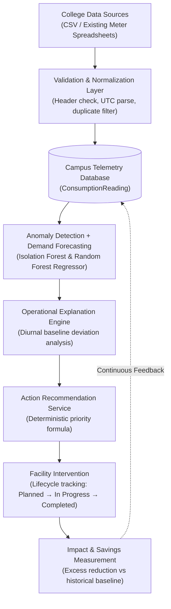

# Campus Resource Autopilot

## From Consumption Data to Action

**Campus Resource Autopilot** is a software-first AI-powered platform for monitoring electricity, water, and waste consumption in educational campuses.

It detects unusual consumption, forecasts upcoming demand, explains possible contributing factors, recommends actions, and tracks intervention impact.

---

### Executive Overview

| Dimension | Details |
| :--- | :--- |
| **WHAT** | An AI-powered campus resource intelligence platform for educational institutions. |
| **WHY** | Help campus facilities teams rapidly identify and act on unusual resource consumption before waste accumulates. |
| **HOW** | A closed-loop pipeline: **Data → Detect → Predict → Explain → Recommend → Measure**. |
| **DIFFERENTIATOR** | A **software-first approach** that delivers immediate value using existing CSV utility logs and interval meter exports today, while remaining architecturally ready for direct IoT and smart-meter streaming tomorrow. |

> [!NOTE]
> **Engineering & Scientific Integrity Disclosures:**  
> - **Ingestion Scope:** CSV upload is the current prototype ingestion interface; live IoT/smart-meter integration is future scope.  
> - **Impact Transparency:** Current demonstration impact values are simulated (85% excess mitigation) because real post-intervention campus telemetry is not yet available. We do not claim simulated savings are real savings.  
> - **Evaluation Honesty:** Machine learning evaluation employs strict chronological holdout splits without random shuffling. Metrics reflect actual empirical performance on calibrated test partitions rather than inflated claims.

---

## Problem

Educational campuses consume enormous volumes of electricity, water, and municipal resources across classrooms, laboratories, residence halls, and dining facilities:
- **High Resource Consumption:** Universities operate diverse facilities with complex operational schedules, resulting in significant resource footprints.
- **Unnoticed Abnormalities:** Broken valves, HVAC scheduling errors, pipe leaks, and off-peak equipment usage often go undetected for weeks until high utility bills arrive.
- **Reporting Without Action:** Many conventional resource monitoring approaches focus primarily on historical dashboards and retrospective reporting.
- **Facility Staff Burden:** Operational teams still have to manually interpret data, deduce possible contributing factors, determine appropriate corrective measures, and justify repair outcomes.

---

## Solution

Campus Resource Autopilot bridges the gap between raw meter telemetry and operational facility action through an automated 6-stage closed-loop pipeline:

```text
Data  ──►  Detect  ──►  Predict  ──►  Explain  ──►  Recommend  ──►  Measure
```

1. **Data:** Ingests campus interval telemetry via software-first CSV upload with canonical validation and deduplication.
2. **Detect:** Unsupervised Isolation Forest models score consumption outliers without requiring labeled historical training data.
3. **Predict:** Multi-step Random Forest regressors forecast upcoming demand horizons to anticipate peak loads.
4. **Explain:** Diagnostic engines evaluate baseline deviations to provide factual, probabilistic operational explanations.
5. **Recommend:** A deterministic priority scoring formula ranks urgency and outputs actionable facility maintenance directives.
6. **Measure:** Compares post-intervention telemetry against matched diurnal baselines to track intervention impact and quantify resource reductions.

---

## Key Features

- **Multi-Resource Monitoring:** Unified tracking for **Electricity** (kWh), **Water** (L), and **Waste** (kg).
- **Software-First CSV Ingestion:** Ingest utility billing exports, BMS logs, and submeter spreadsheets with canonical schema validation and duplicate prevention.
- **Anomaly Detection:** Unsupervised Isolation Forest identifying sudden spikes and persistent baseload leaks.
- **Demand Forecasting:** 24-period multi-step autoregressive demand forecasting with zero data leakage.
- **Explainable Insights:** Factual operational explanations grounded in expected diurnal baselines and percentage deviations.
- **Action Recommendations:** Mathematical priority scoring ($0.0 - 1.0$) mapping alerts to clear facility maintenance checklists.
- **Intervention Tracking:** Complete lifecycle management from detected anomaly to completed work order.
- **Impact Measurement:** Transparent before/after excess reduction metrics with explicit distinction between simulated demo mode and physical telemetry.
- **IoT-Ready Architecture:** Clean abstraction layer decoupling telemetry storage from ingestion transport.

---

## Architecture



> **"Software-first today, IoT-ready tomorrow."**  
> Rather than stalling adoption until every campus building has expensive smart meters installed, Campus Resource Autopilot enables instant onboarding via standard utility CSV files today, while preserving a normalized telemetry database ready for direct IoT gateways (MQTT, BACnet/IP, Modbus) tomorrow.

---

## Technology Stack

### Frontend
- **Framework:** React 18
- **Build Tool:** Vite
- **Styling:** Tailwind CSS + PostCSS (Clean, accessible dashboard theme)
- **Data Visualization:** Recharts
- **Icons:** Lucide React

### Backend
- **Framework:** Python 3.10+ & FastAPI (Asynchronous ASGI)
- **Server:** Uvicorn
- **ORM & Database:** SQLAlchemy 2.0 with SQLite (WAL mode, UTC-aware; retargetable to PostgreSQL)
- **Validation:** Pydantic 2.0

### Machine Learning
- **Library:** Scikit-learn, Pandas, NumPy
- **Anomaly Detection:** Isolation Forest (Unsupervised, contamination=0.02)
- **Demand Forecasting:** Random Forest Regressor (Multi-step autoregressive)

---

## Project Structure

```text
campus-resource-autopilot/
│
├── backend/                      # FastAPI asynchronous backend microservice
│   ├── app/
│   │   ├── api/                  # Modular REST route controllers
│   │   ├── core/                 # Settings, configuration & database setup
│   │   ├── database.py           # Database convenience proxy
│   │   ├── ml/                   # ML core (features, anomaly detector, forecaster)
│   │   ├── models/               # SQLAlchemy ORM database models
│   │   ├── schemas/              # Pydantic validation schemas
│   │   ├── services/             # Domain logic (ingestion, ML, insights, impact)
│   │   └── main.py               # FastAPI application entry point
│   ├── data/                     # Local SQLite database (excluded from Git)
│   ├── scripts/                  # Standalone verification and database seeding tools
│   ├── tests/                    # 58 automated Pytest tests
│   ├── requirements.txt          # Python backend dependencies
│   ├── .env.example              # Backend environment template
│   └── README.md                 # Backend technical documentation
│
├── frontend/                     # React 18 + Vite single-page application
│   ├── src/
│   │   ├── components/           # UI widgets (alerts, charts, insights, impact)
│   │   ├── pages/                # Consolidated dashboard page
│   │   ├── services/             # HTTP REST API client
│   │   ├── App.jsx               # Application root
│   │   └── index.css             # Tailwind CSS styles
│   ├── public/                   # Static public assets
│   ├── package.json              # NPM dependencies & scripts
│   ├── vite.config.js            # Vite configuration and local proxy
│   └── README.md                 # Frontend technical documentation
│
├── docs/                         # Technical & presentation documentation
│   ├── architecture.md           # System components & data flow specifications
│   ├── ml-validation.md          # ML feature engineering & empirical benchmarks
│   ├── demo-guide.md             # Step-by-step 5–7 minute presentation script
│   └── audits/                   # Milestone technical verification audits
│
├── data/
│   └── sample/
│       ├── sample_consumption.csv # Canonical demonstration telemetry CSV
│       └── README.md             # Sample data documentation
│
├── screenshots/                  # Interface screenshots directory
│   ├── README.md                 # Screenshot guidelines & placement instructions
│   └── .gitkeep
│
├── .gitignore                    # Comprehensive Git exclusion rules
├── .env.example                  # Root environment configuration template
├── LICENSE                       # MIT Open Source License
└── README.md                     # This file
```

---

## Getting Started

### Prerequisites
- **Python:** Version 3.10 or higher (Tested with Python 3.13)
- **Node.js:** Version 18 or higher (Tested with Node.js 20+)
- **Git:** For repository management

---

### Backend Setup

1. Open a terminal and navigate to `backend/`:
   ```bash
   cd backend
   ```

2. Create and activate a Python virtual environment:
   - **Windows (PowerShell):**
     ```powershell
     python -m venv venv
     .\venv\Scripts\Activate.ps1
     ```
   - **Windows (Command Prompt):**
     ```cmd
     python -m venv venv
     .\venv\Scripts\activate.bat
     ```
   - **macOS / Linux:**
     ```bash
     python3 -m venv venv
     source venv/bin/activate
     ```

3. Install dependencies:
   ```bash
   pip install -r requirements.txt
   ```

---

### Database Setup & Seeding

> [!IMPORTANT]
> **Database Safety Notice:**  
> - **Normal Application Startup:** Automatically creates tables if they do not exist, but **NEVER deletes or wipes existing telemetry**.  
> - **Development Seed / Reset (`scripts/seed_data.py`):** An explicit development script that resets the database and populates 30 days of calibrated demonstration telemetry (7,350 readings, 15 meters, 73 deliberate anomaly points).

To populate the development database for the first time:
```powershell
python scripts/seed_data.py
```
*Expected: "Success! Created 5 buildings, 15 meters. Inserted 7,350 consumption readings."*

---

### Starting the Application

#### 1. Start the Backend API Server
In your activated backend terminal:
```powershell
python -m uvicorn app.main:app --reload --port 8000
```
- Interactive API Docs: [http://localhost:8000/docs](http://localhost:8000/docs)
- Health Check: [http://localhost:8000/api/health](http://localhost:8000/api/health)

#### 2. Start the Frontend Development Server
Open a second terminal, navigate to `frontend/`:
```bash
cd frontend
npm install
```

Start the Vite dev server:
- **Windows (PowerShell):**
  ```powershell
  $env:PATH = 'C:\Program Files\nodejs;' + $env:PATH; npm.cmd run dev
  ```
- **Windows (Command Prompt):**
  ```cmd
  set PATH=C:\Program Files\nodejs;%PATH% && npm run dev
  ```
- **macOS / Linux:**
  ```bash
  npm run dev
  ```

Open your browser at **[http://localhost:5173](http://localhost:5173)**.

---

### Running Automated Tests & Verification

#### Run Pytest Backend Test Suite:
```powershell
cd backend
pytest -v
```
*Result: 58 passed in ~6.7s (58/58 passed).*

#### Run End-to-End Demo Flow Verification:
```powershell
python scripts/verify_demo_flow.py
```
*Result: All 10 steps verified [OK].*

#### Run Frontend Production Build:
```powershell
cd frontend
npm run build
```
*Result: Vite production bundle created in `dist/` with 0 errors.*

---

## Data Ingestion

Campus Resource Autopilot includes an integrated CSV ingestion engine allowing facility managers to upload existing utility data without code changes:

### Required Canonical Headers
```csv
timestamp,building,resource_type,value
```

| Column | Format | Constraints | Example |
| :--- | :--- | :--- | :--- |
| `timestamp` | ISO-8601 or YYYY-MM-DD HH:MM:SS | Converted to UTC naive | `2026-09-01 10:00:00` |
| `building` | String | Case-insensitive match to registered campus buildings | `Science & Engineering Complex` |
| `resource_type`| String | Must be `electricity`, `water`, or `waste` | `electricity` |
| `value` | Float | Must be non-negative ($\ge 0.0$) | `195.2` |

### Validation & Processing Flow
- **Row-Level Validation:** Parses timestamps, verifies registered buildings and meters, and enforces numerical constraints.
- **Duplicate Prevention:** Checks `(meter_id, timestamp)` both within the upload batch and against the database, bypassing duplicates safely without crashing transactions.
- **Atomic Commits:** All valid rows are persisted in a single transaction. Any database exception rolls back changes cleanly.
- **Downstream Recalculation:** New readings immediately feed downstream anomaly scoring, forecasting, and historical charts.

> **"CSV is the current prototype ingestion method. Live IoT/smart-meter integration is future scope."**

---

## Machine Learning

The machine learning layer operates with strict temporal causal integrity:
- **Zero Future Data Leakage:** Lag features ($t-1, t-2, t-24$) and rolling statistics are calculated exclusively from `shift(1)` historical observations. Observation $t$ is strictly never included in its own rolling window.
- **Unsupervised Anomaly Detection:** Scikit-learn `IsolationForest` scores multi-meter readings into normalized outlier indices ($0.0 - 1.0$), identifying baseload deviations without requiring labeled historical anomalies.
- **Autoregressive Forecasting:** `RandomForestRegressor` steps forward across 24 horizons (hourly for electricity/water, daily for waste), propagating predictions into subsequent lag features.

---

## Evaluation & Empirical Benchmarks

Evaluation is conducted using a strict **chronological 80/20 train/test split** (Days 1–24 training, Days 25–30 holdout testing) without random shuffling:

| Resource | Horizon / Freq | Forecast MAE | Forecast RMSE | Anomaly Precision | Anomaly Recall | Anomaly F1 |
| :--- | :--- | :--- | :--- | :--- | :--- | :--- |
| **Electricity** | Hourly (24h) | **17.34 kWh** | **71.15 kWh** | 0.000 | 0.000 | 0.000 (See Note) |
| **Water** | Hourly (24h) | **113.24 L** | **190.12 L** | **0.2083** | **0.2083** | **0.2083** |
| **Waste** | Daily (24d) | **153.79 kg** | **254.99 kg** | **0.2500** | **1.0000** | **0.4000** |

> **Scientific Honesty on Electricity Anomaly Metrics (F1 = 0.000):**  
> In the 30-day realistic campus seed, the single deliberate electrical surge occurred on **Day 15** (inside the 80% training window). As a result, the 20% holdout window contains **0 ground-truth anomalies**. Rather than fabricating fake positive events or manipulating the chronological split to artificially inflate numbers, the platform transparently reports `0.000`. Full details are documented in [docs/ml-validation.md](docs/ml-validation.md).

---

## Impact Measurement & Transparency

Campus Resource Autopilot includes a closed-loop facility intervention tracking engine:
- **Matched Baseline:** Evaluates non-anomalous historical medians conditioned on the identical day-of-week and hour.
- **Before vs. After Analysis:** Quantifies absolute and percentage reductions in excess consumption.
- **Simulation Disclaimer:**  
  > *"Current demonstration impact values are simulated because real post-intervention campus telemetry is not yet available."*  
  In demonstration mode, the platform models an 85% excess mitigation after facility repairs. The UI explicitly badges these figures with `"SIMULATED DEMO IMPACT"`, clearly separating prototype simulations from physically measured meter telemetry.

---

## Live Demo Flow (5–7 Minutes)

1. **Open Dashboard:** View campus-wide KPI summaries for Electricity, Water, and Waste across 5 facilities.
2. **Select Water:** Filter views to inspect water telemetry and persistent consumption trends.
3. **View Anomaly:** Inspect the detected water surge at Science & Engineering Complex (563.2 L vs 128.2 L baseline).
4. **View Explanation:** Read the factual operational explanation (+339.3% baseline deviation, highlighting possible plumbing-related issues or simultaneous fixture usage).
5. **View Recommendation:** Review the priority-ranked operational maintenance checklist.
6. **Create Intervention:** Click **"Take Action"** to generate a tracked facility ticket.
7. **Simulate Impact:** Click **"Simulate & Verify"** to compute excess mitigation in demonstration mode.
8. **View Before → After:** Inspect before (563.2 L) vs after (193.5 L) consumption and simulated estimated savings (369.8 L mitigated).
9. **View Forecast:** Review the 24-hour demand projection chart and empirical model evaluation benchmarks.

*For complete speaker notes and pitch scripts, see [docs/demo-guide.md](docs/demo-guide.md).*

---

## Limitations

- **Prototype Ingestion:** Data is currently ingested via batch CSV uploads; live streaming via IoT protocols is not yet implemented.
- **Simulated Impact:** Post-intervention reductions in the demonstration flow use mathematical simulation models until live post-repair sensors are installed.
- **Resource Distribution Differences:** Anomaly performance metrics vary across resources based on the frequency and timing of historical events in the 30-day sample.
- **Waste Horizon:** Waste telemetry is recorded daily; forecasting evaluates on a daily horizon without fabricating artificial hourly points.

---

## Future Scope

- **Smart Meter & BMS Integration:** Direct streaming connectors for BACnet/IP, Modbus TCP, and MQTT brokers.
- **IoT Environmental Sensors:** Weather and indoor ambient occupancy correlation (temperature, humidity, CO2).
- **Automated Work Order Dispatch:** Direct webhooks into campus CMMS platforms (e.g., ServiceNow, Maximo).
- **Multi-Campus Support:** Multi-tenant architecture for state university systems and multi-site institutional facilities.

---

## License

This project is licensed under the **MIT License** — see the [LICENSE](LICENSE) file for details.
