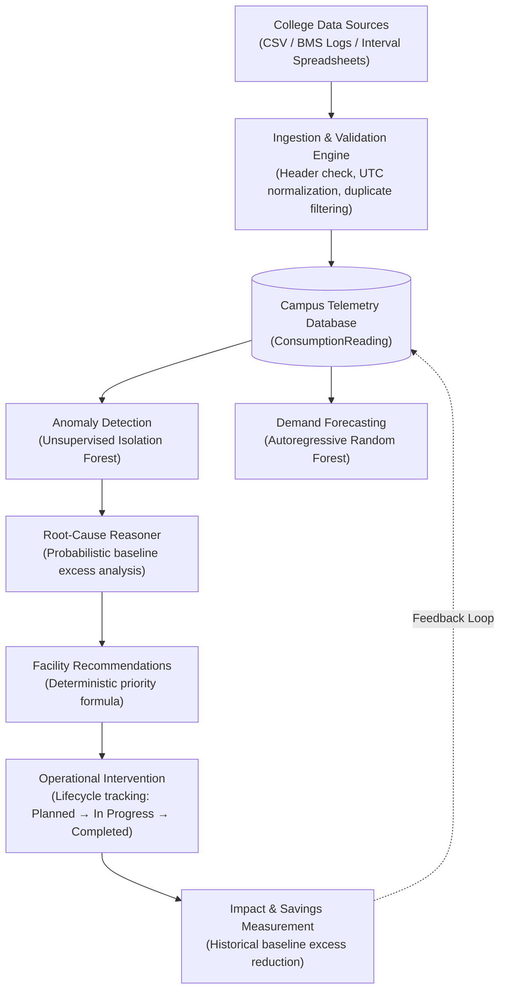
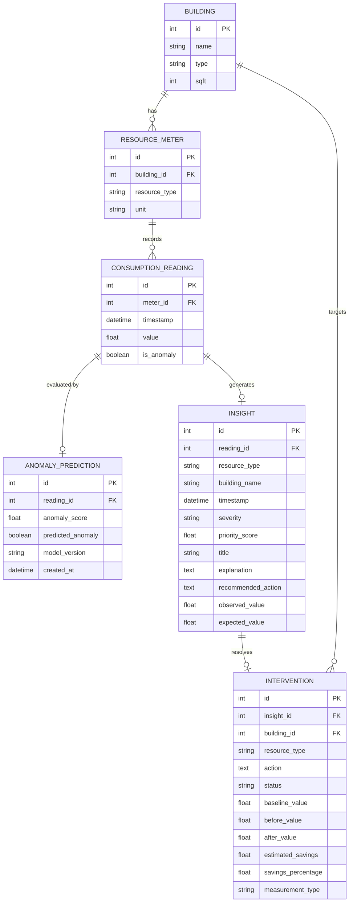

# Architecture & System Design — Campus Resource Autopilot

## 1. System Overview

**Campus Resource Autopilot** is a software-first campus sustainability platform designed to monitor electricity, water, and waste consumption across educational facilities. The platform detects unusual consumption, forecasts upcoming demand, explains contributing operational factors, recommends maintenance actions, tracks facility interventions, and measures verified resource impact.

> **Guiding Architectural Philosophy:** *"Software-first today, IoT-ready tomorrow."*  
> Universities rarely have unified IoT submetering infrastructure across all facilities on day one, but they do have utility billing spreadsheets, BMS log files, and interval meter exports. Campus Resource Autopilot ingests standard CSV records today while maintaining a telemetry storage abstraction ready for direct smart-meter and BMS gateway streaming tomorrow.

---

## 2. End-to-End Pipeline

---

## 3. Core System Components

### 3.1 Frontend Layer (`frontend/`)
- **Technology:** React 18, Vite, Tailwind CSS, Recharts, Lucide React.
- **Role:** Presents an executive dashboard with high-level KPI cards, interactive 7d/30d telemetry time-series charts, anomaly alert feeds, 24-step forecast projections, root-cause insights with actionable facility directives, and an impact verification center.
- **Communication:** Communicates with the FastAPI backend over HTTP REST via a centralized client (`src/services/api.js`). In local development, Vite proxies `/api` requests to `http://localhost:8000`.

### 3.2 Backend REST Layer (`backend/app/api/`)
- **Technology:** FastAPI, Uvicorn, Pydantic, Python 3.10+.
- **Routers:**
  - `health.py`: Verifies service status and live database connectivity (`SELECT 1`).
  - `resources.py`: Aggregates consumption metrics and time-series historical windows.
  - `ml.py`: Exposes Isolation Forest anomaly detection, multi-step demand forecasting, and empirical evaluation metrics.
  - `insights.py`: Coordinates root-cause explanations and prioritized recommendations.
  - `interventions.py`: Manages the intervention lifecycle (creation, demo simulation, completion, and impact aggregation).
  - `ingestion.py`: Handles CSV upload processing, template generation, and batch ingestion.

### 3.3 Domain & Intelligence Services (`backend/app/services/`)
- **`IngestionService`:** Validates canonical headers (`timestamp,building,resource_type,value`), parses dates to UTC, matches buildings and meters, detects in-batch and database duplicates, and commits valid rows atomically.
- **`MLService`:** Interfaces between database models and scikit-learn models, caching trained estimators in memory to eliminate repeated training overhead.
- **`ExplanationService`:** Synthesizes observed consumption, expected diurnal/day-of-week baselines, and percentage deviations into factual, hedged diagnostic reasons.
- **`RecommendationService`:** Evaluates a deterministic priority scoring formula ($0.0 - 1.0$) to rank severity (`CRITICAL`, `HIGH`, `MEDIUM`, `LOW`) and produces maintenance-ready facility directives.
- **`ImpactService`:** Queries historical non-anomalous medians for comparable day-of-week/hour slices, computes excess consumption before and after repairs, and estimates resource savings.

### 3.4 Machine Learning Engines (`backend/app/ml/`)
- **`features.py`:** Generates temporal calendar features (`hour`, `day_of_week`, `is_weekend`, `month`), autoregressive lags ($t-1, t-2, t-24/t-7$), and strict backward-looking rolling statistics computed exclusively on shifted historical windows (`shift(1)`). Observation $t$ is strictly never included in its own rolling window (zero future leakage).
- **`anomaly_detector.py`:** Trains unsupervised `IsolationForest` models per resource type, normalizing decision function scores to $[0.0, 1.0]$.
- **`demand_forecaster.py`:** Implements `RandomForestRegressor` with dynamic multi-step autoregression, feeding predicted values forward into lag and rolling features.
- **`predictor.py`:** High-level coordinator managing training, inference, and chronological holdout evaluation.

### 3.5 Database & Persistence Layer (`backend/app/models/`)
- **Technology:** SQLAlchemy 2.0 ORM with SQLite (WAL mode) for local deployment, easily retargetable to PostgreSQL via environment variable (`DATABASE_URL`).
- **Core Entities:**
  - `Building`: Campus facilities categorized by type (Academic/Lab, Residential, Dining, Student Life, Library) and square footage.
  - `ResourceMeter`: Physical or virtual meters tracking `electricity` (kWh), `water` (L), or `waste` (kg).
  - `ConsumptionReading`: Primary time-series telemetry storage storing timestamp, value, and ground-truth simulation flag.
  - `AnomalyPrediction`: Persisted model predictions, anomaly scores, and model metadata.
  - `Insight`: Generated explainability records, priority scores, and facility directives.
  - `Intervention`: Action tickets linking insights to verified or simulated post-repair savings.

---

## 4. Database Schema Relationships

---

## 5. Software-First Today, IoT-Ready Tomorrow

The platform separates telemetry ingestion from consumption analysis:
1. **Current Prototype (Software-First):** Receives historical CSV exports, BMS reports, and utility interval records through `POST /api/ingestion/upload`.
2. **Future Architecture (IoT Integration):** Because `ConsumptionReading` is normalized and decoupled from ingestion transport, an MQTT broker, BACnet IP connector, or Modbus listener can stream interval readings directly into `ConsumptionReading` via the same service validation rules without touching ML models, explainability engines, or frontend dashboards.
